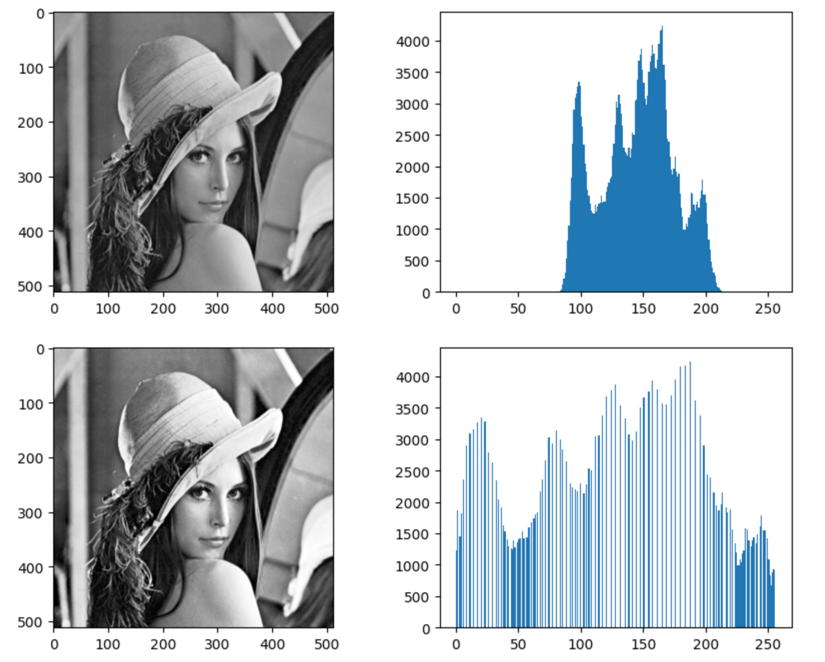
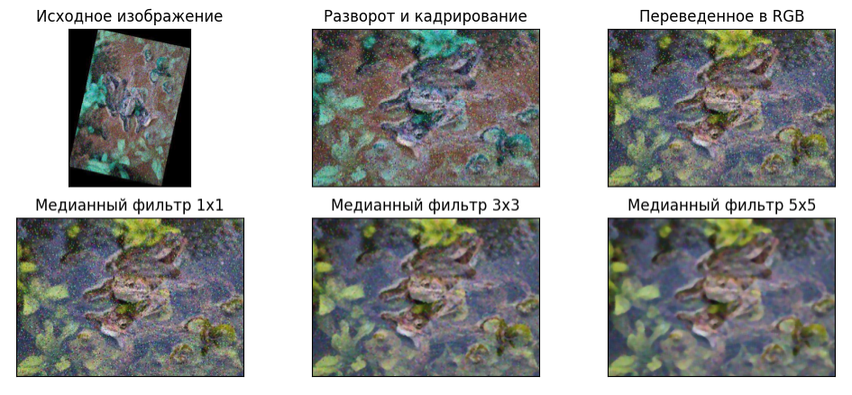
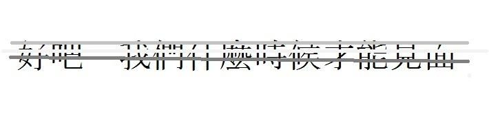
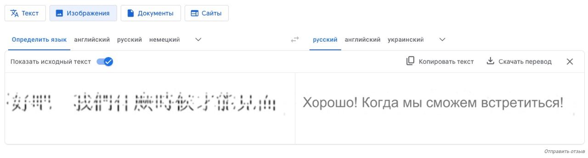
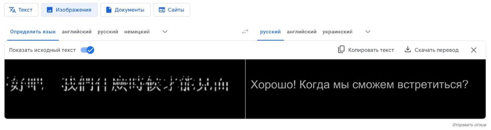

# Цифровая обработка сигналов

## Лабораторная работа #1
### Задание
Создать массив со случайными значениями и максимальный элемент заменить на 0
### Реализация
Реализация описана в файле [replace_max_to_zero](replace_max_to_zero.py)
### Ввод/вывод
Генерация массива заполняемого рандомными элементами:
`[89 22 45 60 29 54 87 96  1 82]`

Замена максимального элемента нулем:
`[89 22 45 60 29 54 87  0  1 82]`

## Лабораторная работа #2
### Задание
Реализовать эквилизацию изображения в соответствии с формулой
### Реализация
Реализация описана в файле [image_equalization](image_equalization.ipynb)
### Ввод/вывод
Исходное изображение и гистограмма / преобразованное изображение и гистрограмма 

## Лабораторная работа #3
### Задание
Восстановить исходное изображение
### Реализация
Реализация описана в файле [image_recovery](image_recovery.ipynb)
### Ввод/вывод
Исходное изображение и шаги преобразования для восстановления изображения

## Лабораторная работа #4
### Задание
Осуществить пороговую фильтрацию изображения и перевести текст
### Реализация
Реализация описана в файле [threshold_filtering](threshold_filtering.ipynb)
### Ввод/вывод
Исходное изображение

Результаты перевода

